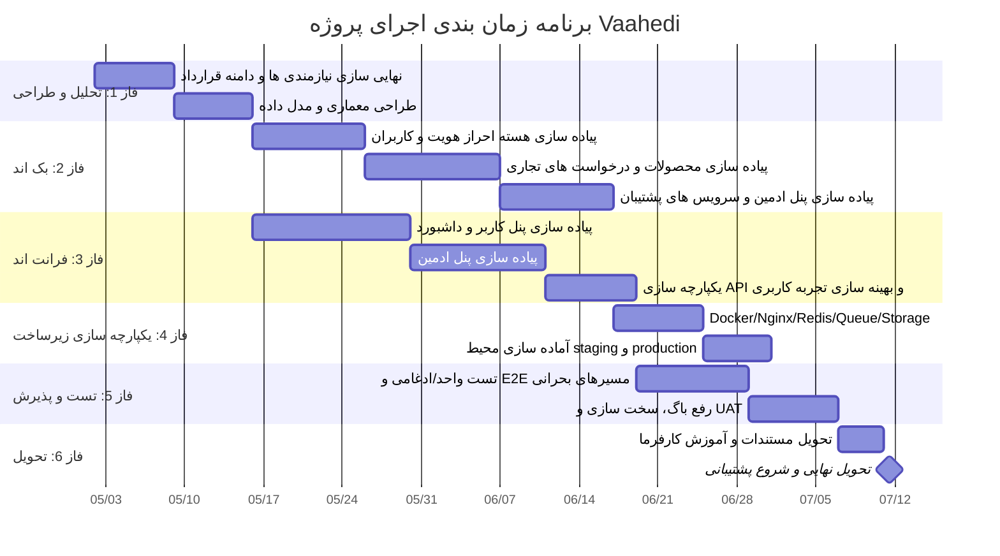

# خلاصه یک صفحه ای + پیوست تعهدات + گانت چارت پروژه Vaahedi

## 1) جدول خلاصه مدیریتی (یک صفحه ای)

| موضوع | وضعیت/عدد پیشنهادی | توضیح قراردادی کوتاه |
|---|---:|---|
| هدف پروژه | تحویل نسخه نزدیک به وضعیت فعلی محصول | مبنای کار: توسعه از صفر تا تحویل عملیاتی |
| برآورد زمان کل | 720 تا 1150 ساعت | عدد بر اساس جمع تفکیک فازها تنظیم شده است |
| قیمت فروش محصول (نمونه) | 12,000,000,000 ریال | فرمول: ساعت × نرخ ساعتی × ضریب مالکیت |
| بازه ضریب مالکیت | 1.3 تا 2.0 | شامل ارزش محصول آماده، کاهش ریسک و انتقال دانش |
| هزینه سال اول (Pars.Host + SSL تک دامنه + پیمانکار) | 1,346,390,000 ریال | هزینه بهره برداری سال اول، جدا از قیمت فروش محصول |
| هزینه سال اول (Pars.Host + Wildcard + پیمانکار) | 1,476,667,000 ریال | مناسب معماری چند ساب دامنه |
| هزینه سال اول (IranServer + SSL تک دامنه + پیمانکار) | 1,471,743,600 ریال | گزینه جایگزین زیرساخت |
| هزینه سال اول (IranServer + Wildcard + پیمانکار) | 1,592,163,600 ریال | بیشترین هزینه در سناریوهای فعلی |
| وضعیت OTP پیامکی | نیازمند توسعه جدید | در نسخه فعلی به عنوان ماژول عملیاتی کامل قرارداد نشده است |
| هزینه OTP | ثابت + متغیر | پلن سالانه + (تعداد OTP سالانه × هزینه هر OTP) |
| مبنای قیمت زیرساخت | استعلام مورخ 2026-04-17 | قیمت ها شناور هستند و روز خرید باید تایید شوند |

## 2) پیوست تعهدات امکانات برنامه (مبنای قرارداد)

### 2-1) دامنه تعهد اصلی

| حوزه | قابلیت های مشمول تعهد | معیار پذیرش تحویل | خارج از تعهد مستقیم | وابستگی/پیش نیاز |
|---|---|---|---|---|
| احراز هویت | ثبت نام، ورود، خروج، مدیریت پروفایل پایه کاربر | انجام سناریوهای اصلی بدون خطای بحرانی در محیط تحویل | احراز هویت چندعاملی پیشرفته، SSO سازمانی | دسترسی به سرویس پیامکی/ایمیل و تنظیمات دامنه |
| کاربران و پروفایل | مشاهده و ویرایش اطلاعات پروفایل کاربر | ذخیره سازی صحیح و بازیابی اطلاعات | مهاجرت داده تاریخی از سیستم های ثالث | ارائه فیلدهای نهایی مورد تایید کارفرما |
| مدیریت محصول | ایجاد، ویرایش، حذف، مشاهده لیست و تایید | CRUD کامل با اعتبارسنجی و گزارش خطای قابل فهم | فرایندهای ERP/حسابداری یکپارچه | تعریف قوانین کسب وکار محصول توسط کارفرما |
| درخواست های تجاری | ثبت درخواست، لیست، تطبیق و تحلیل | ثبت و بازیابی صحیح، نمایش نتایج تطبیق | تحلیل هوشمند سفارشی سطح Enterprise | تعیین قواعد امتیازدهی/تطبیق توسط کارفرما |
| چت کاربر | ایجاد مکالمه، ارسال/دریافت پیام، مدیریت گفتگو | تداوم مکالمه و ذخیره تاریخچه | تضمین SLA مدل های خارجی AI | کلید API و اعتبار سرویس ثالث |
| چت مبتنی بر AI | اتصال به سرویس سازگار با OpenAI/Gemini | دریافت پاسخ معتبر در سناریوهای تست تعریف شده | تضمین کیفیت محتوای تولیدی مدل | پایداری سرویس های ثالث و سهمیه مصرف |
| پنل ادمین | مدیریت کاربران، محصولات، اخبار، اسناد، پشتیبانی، اعلان | دسترسی نقش محور و عملیات مدیریتی اصلی | گزارش ساز سفارشی BI و داشبورد سفارشی بسیار پیشرفته | تعریف سطوح دسترسی نهایی و فرآیند تایید کارفرما |
| زیرساخت استقرار | Docker Compose، Nginx، آماده سازی محیط تولید | استقرار موفق نسخه Release و دسترس پذیری پایه | مدیریت دیتاسنتر، شبکه داخلی کارفرما، امنیت فیزیکی | دسترسی سرور، دامنه، DNS، SSL |
| کیفیت و تست | اجرای تست های واحد/ادغامی و E2E مسیرهای بحرانی | پاس شدن تست های تعریف شده قرارداد | تضمین صفر باگ در همه سناریوهای آینده | تایید سناریوهای پذیرش توسط کارفرما |

### 2-2) مواردی که حتما باید در متن قرارداد شفاف شود

| آیتم حقوقی/اجرایی | متن پیشنهادی کوتاه |
|---|---|
| تفکیک قیمت محصول و بهره برداری | قیمت فروش محصول مستقل از هزینه سال اول زیرساخت و نگهداری است. |
| مدیریت تغییرات | هر نیازمندی جدید خارج از دامنه، پس از CR و توافق زمان/هزینه انجام می شود. |
| وابستگی به سرویس ثالث | اختلال یا تغییر قیمت/سیاست سرویس دهنده های خارجی خارج از کنترل پیمانکار است. |
| سطح پشتیبانی | زمان پاسخ، زمان رفع، ساعات سرویس و کانال ارتباطی به صورت SLA پیوست شود. |
| امنیت و پشتیبان گیری | سیاست بکاپ، دوره نگهداری، RPO/RTO و مسئولیت بازیابی دقیق تعیین شود. |
| تحویل و پذیرش | معیار پذیرش، چک لیست تحویل، و مدت اعلام مغایرت توسط کارفرما مشخص شود. |

### 2-3) وضعیت OTP برای جلوگیری از تعهد مبهم

| موضوع | وضعیت پیشنهادی برای قرارداد |
|---|---|
| OTP پیامکی برای تایید/اپروو حساب | به عنوان ماژول توسعه ای مستقل تعریف شود (فاز جداگانه یا آپشن مالی) |
| هزینه OTP | شامل هزینه پلن سالانه + هزینه متغیر هر پیامک بر اساس نرخ روز سرویس دهنده |
| معیار تحویل OTP | ارسال موفق کد، اعتبارسنجی کد، محدودیت دفعات تلاش، لاگ رویداد و گزارش خطای استاندارد |

## 3) گانت چارت پیشنهادی (16 هفته)

## 4) جمع بندی قابل ارسال برای کارفرما

- این سند به صورت همزمان سه نیاز کارفرما را پوشش می دهد: خلاصه مدیریتی، دامنه تعهد قراردادی، و زمان بندی اجرایی.
- برای جلوگیری از تعهد مازاد، هر قابلیت با معیار پذیرش و مرز خارج از تعهد تعریف شده است.
- اعداد مالی زیرساخت و OTP شناور هستند و تایید نهایی باید در روز خرید انجام شود.

